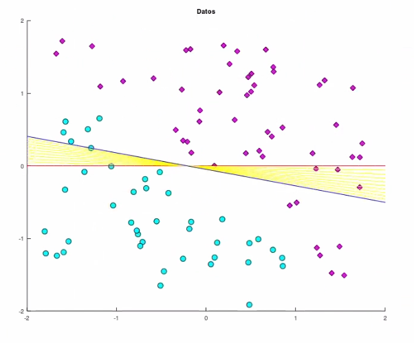
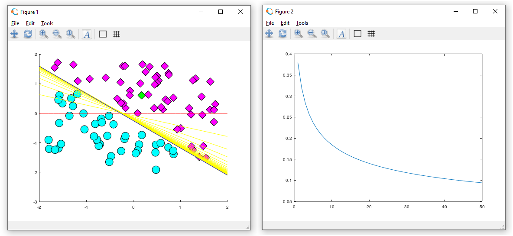
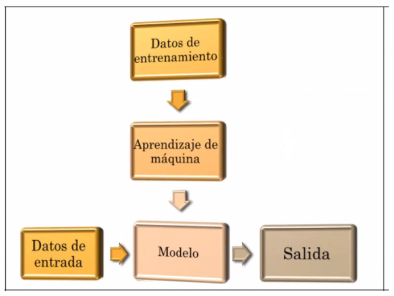
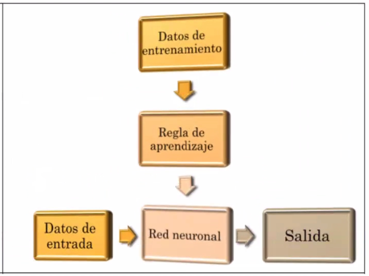
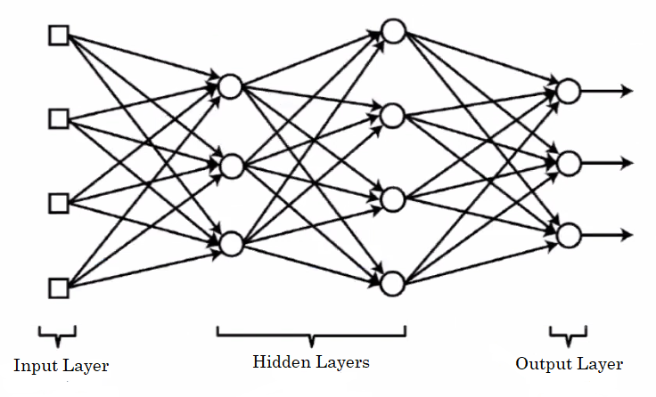
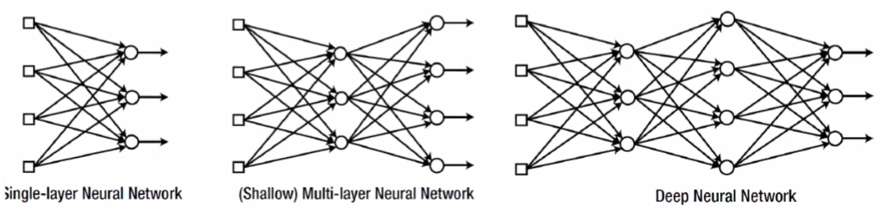
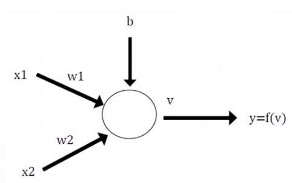

# Notes

At the start we can plot the initial hypothesis line. In reality, since we have 2 characteristics or features, the model is a plane:

but if we want to plot a line, we set z = 0. In the image, we are seeing the whole plot from z = 0, and we can see a range [-2,2] for x_1. Thus, we can solve for x_2 and it would be a line where x_1 is the independent variable and x_2 the dependent variable, since z = 0.

we can see this in the red line:

Had we left the process at that line, and all the points **over** the line would be diamonds and all points **under** the line would be circles.

As we can see in the image, the classification has errors, thus the process is not finishing. Here we have two options: either we give it more iterations or increment beta. The ideal is to first change beta (0.1) and if that does not work, add time. This is because we want our algorithm to work the fastest it can. Thus, we move beta to 1.5.

In this case we can see the J plot and adjust the iterations until J stabilizes, which is at 50 iterations. But, as seen in the previous section, know that this could have happened earlier, but looking at J plot is a safe way to know when to stop.

- The J function's only purpose is for training the process, not for rating how good the prediction is.

- At the end of the process, the import thing is to save the final **a** vector with the values that optimize J.

- The mean and standard deviation with which you must normalize the input test point (green point), before testing with the model, are calculated from the original data set **x**.

# Neural Networks

We saw before that the structure of Machine Learning worked like this:

So far we have seen three ML techniques: Univariate Linear Regression, Multivariate Linear Regression and Logistic Regression. The models worked in two ways: predict a floating point number and predict a discrete output of a class.

Neural Networks and Machine Learning are two different disciplines from Artificial Intelligence, but a way to fusion them is the following:

Now, the Machine Learning algorithm are now **Learning Rules**, and these are proper from the Neural Network area. This will output as a **model** a **neural network**.

Neural Networks are classified depending on how their structure is. Neural networks are constituted from **neurons**, which are **each node in the network diagram.**

A Neural Network will always have:

- **Input Layer**: distinguished with small squares, in this case this network has 4 input data points. Each neuron in the following layer must be connected to each input.

- **Hidden Layer(s)**: The inner neurons with their weighted connections.

- **Output Layer**: Can be constituted from one or more neurons, depending on how many output points we need, and in the case of classification problems, will be the **predicted class**. In these problems, we would need only **one neuron that outputs either 0 or 1**  depending on the data point belonging to one class or the other.

The input and other neurons are connected to other nodes or neurons via an arrow, which simulates the brain's connections. This connections have an associated **weight**.

Thus, we classify a neural network (NN) depending on how many **hidden layers** the network has:

- **Single-Layer NN (Simple)**: it only has an input and output layer.

- **Multi-layer NN (Shallow)**: it only has one hidden layer, and it is called multilayer because in total we have more than 2 layers (input, inner, output).

- **Deep NN**: it has more than one hidden layer, before the output layer.

The Machine Learning algorithm that merges NN with binary classification is called **Perceptron**. This algorithm uses one network, and it is of type Single-Layer, with only one output neuron in the output layer that outputs wither 0 or 1, which looks like below.

The input layer is the one that has x_1 and x_2, this layer includes **the training data features** which can go until x_n. In the example, the training set has two characteristics of features. The weights in the connections are w_1 and w_2, and these weights are directly related to the influence a feature has on the output. If a feature does not influence the output neuron, the weight is 0.