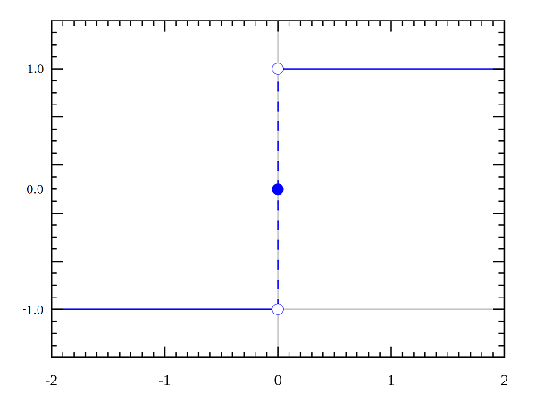

# Notes

## The Perceptron

It is a classification method that uses the following neural network:

Where this network only has one neuron, and all the features are the input layer that connect to this neuron, which produces an output that is a binary output. The neuron has one output because there are only two classes. 

For multiple classification (many classes) we would have more neurons in the output layer, and each of these neurons represent a class and its output would be either 0 or 1, and thus only one results in 1 and the remaining classes are 0's. If we had, for example, 4 classes, we would have as an output layer 4 neurons that output 0 or 1.

- The input layer will be the **training data**. The image above represents only one data entry. If the data set has N features, we will have N inputs to the neuron. Thus, the input depends on the amount of features that the data set has.

- Each input is connected to the neuron by a **weight**, w1 for input x1, which comes from feature 1. If we had more neurons, each input needs to be connected to each of the neurons in the next layer with a *different* weight.

- Each output layer neuron has one output. Neurons of the inner layers have more than one intermediate output.

## Calculate the Output of A Neural Network

In order to calculate the output of the neural network of the perceptron, we need:

- Calculate a partial output, called **v**. This is a temporary output that will generate the final output f(v). The partial outcome v is calculated multiplying the weights times the inputs:

where b stands for bias. Not all networks have a bias, it depends on the application. The bias is a kind of translation (equivalent of a_0 in logistic regression), and in this case, the bias controls a bit of the decision line that we will generate.

In other cases where we have more neurons, w would be a matrix instead of a vector.

- Then, we need to define y, which changes depending on which classification it is. the f(v) is an **activation function**, such as the Sigmoid Function.

- The vector **x** represents one data set point, that contains two features, x_1 and x_2. Then we will calculate y with the above functions, and y will be the **network output**. After having our output y, we will compare this y with the known correct output Y, which means we will compare the class of these two outcomes. The difference between y and Y will generate an **error**.

- The **error** will be used to update the neural network, and more specifically, we will update the weights and bias.

- Thus, the objective of the algorithm is to find the w_1, w_2 and b that generates a neural network that, for each data set input, the output is the correct class of that training/test input point.

- The weights are updated using a learning factor similar to beta, now called **a**, which basically is a step variable that regulates how much we update in each iteration or epochs.

where **x** is the input that generated the error. Thus, if there is an error, we will update the weights using the data input that generated said error. There is only two different weights for all the data set input points x_i (training data x_i). Therefore, the weights are numbers that, for all training data points, produce us a neural network that classifies correctly.

- We also need to normalize the training data for this algorithm, so that the update of weights is not affected by the data value itself.

As we mentioned, the f(v) function transforms v and is thus an activation function, such as the Sigmoid Function. This time, we do not need to optimize J function, instead we only need to evaluate the error using an activation function due to the Perceptron Algorithm. We will use the Activation Function called Step Function (Función Escalón).

This step function takes the values -1 and 1, because those are the class values that are chosen. We could as well have used the Unitary Step Function, which touches 0 and 1, but we choose the labels -1 and 1 for the two classes.

*Note: if we have perfectly linearly separable data, the error with this algorithm can be 0.*

