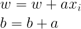

# Notes

## Learning Factor *a*

It is important to note that the weights are updated taking on account the current weight but also a **learning factor a** times the data input point that generated **error**. The learning factor **a** is a constant value that is a configuration parameter that is fixed from the beginning of the learning process.

The value *a* is one for each data set, and it varies between the range of [-1,1], approximately. It is similar to **beta** parameter is Linear Regression and Logistic Regression, but now if **a** is either **too small or too big the solution never converges**, whereas a small beta meant a slow convergence and a big beta meant not convergence.

- The perceptron algorithm is not an optimization problem, since there is not cost function to minimize.

There will be an update in the weights if there is **error**, since the error is the difference between the correct classification for the current data point and the predicted classification for the current data point. Thus, if the classification is correct both classes are equal and the **difference is 0**, so there is **no weight update** during that input data point processing iteration.

In this algorithm, if the training data / test data set is linearly separable, **the error can be zero**. The error in this algorithm **is a measure of performance**, since the error is the count of data points well classified, a discrete value.

## Example

Given the data set:

| x1 | x2 | Y |
| ---- | ---- | ---- |
| -1 | -1 | -1 |
| 1 | -1 | -1 |
| -1 | 1 | -1 |
| 1 | 1 | 1 |

where m = 4 and n = 2 (number of features) and two classes, and generates the following network:


*Note: we only have one output because we have only two classes.*

Now, we initialize the parameters that at the end are optimized for the minimum error:

- weights (control the slope of the decision line), can be zero.

    - w1 = 0.5

    - w2 = 0.8

- bias (controls the translation of the decision line).

    - b = 0.5

They are basically randomly initialized parameters, but generally all three parameters should be initialized more or less between [-1, 1] for **all cases**, unrelated to the class values. They sometimes can result in higher or smaller numbers, but slightly, never values like 10 or 100, which are highly strange to find. These three values can be set initially to 0, but can never result all three in zeroes, since that would mean there is only one class.

- a (learning factor), shouldn't be too small nor too large.

    - a = -0.5

Training data should also be normalized in this algorithm.

- Let's see the first epoch:

Using:

 

and 

 

| **x_i** | **v** | **y** (perdicted class) | Y==y (error) | **b** | **w1** | **w2** |
| ---- | ---- | ---- |---- | ---- | ---- | ---- |
| [-1 -1] | v = [0.5 0.8]x[-1; -1] + 0.5 = 0.8 | y= f(v) = -1 | True (No Update) | 0.5 | 0.5 | 0.8 |
| [1 -1] | v = [0.5 0.8]x[1; -1] + 0.5 = 0.2 | y= f(v) = 1 | False (Update) | 0.5 - 0.5 = 0 | 0.5 - 0.5x1 = 0 | 0.8 -0.5*-1 = 1.3 |
| [-1 1] | v = [0 1.3]x[-1; -1] + 0 = 1.3 | y= f(v) = 1 | False | 0 - 0.5 = -0.5 | 0 - 0.5x-1 = 0.5 | 1.3 - 0.5x1 = 0.8 |

## Implementation

- After coding the learning process in a `while` loop, we need to plot the decision line. Strictly in this case would be a plane, since there are two features and thus 3 dimensions, but we will look at the plot from z = 0. If z = 0, and we have the equation below. but if we make a sample for x1 (our independent variable), we solve for x2 (dependent variable of the line):


- For the convergence plot:

| Known | Predicted | Difference |
| ---- | ---- | ---- |
| Y = -1 | y = -1 | Y - y = 0 |
| Y = -1 | y = 1 | Y - y = -2 |
| Y = 1 | y = 1 | Y - y = 0 |
| Y = 1 | y = -1 | Y - y = 2 |

Thus, when there's no error, the difference is always 0. But, if there's error, the difference can either be -2 or 2. If in this algorithm the error is the count of how many data points are wrong, then we compute the `error` as:

```m
error = sum(abs(Y-y))/2;
```

and this is derived from our f(v) taking values of -1 or 1.

### Solution

- perceptron.m

```m
clear all
close all

x = [-1 -1;
      1 -1;
     -1 1;
     1 1];
Y = [-1;
      -1;
      -1;
      1];
      
[m,n] = size(x);

% initial hypothesis
b = 0.5;
W = [0.5 0.8];
a = -0.5;

% stop criteria: iterations/epochs
epoch = 1;
epoch_max = 10;

% plot input data
class_neg_one = find(Y==-1);
class_one = find(Y==1);
figure(1)
hold on
plot(x(class_neg_one,1), x(class_neg_one,2), 'ok', 'MarkerFaceColor', 'm', 'MarkerSize', 7)
plot(x(class_one,1), x(class_one,2), 'sk', 'MarkerFaceColor', 'c', 'MarkerSize', 7)
axis([-1.5 1.5 -1.5 1.5])

xlabel('x1')
ylabel('x2')

% linspace for plotting
x1 = -1.5:0.1:1.5;
x2 = (-W(1)*x1 - b)/W(2);
% first line depending on initial hypothesis
plot(x1,x2,'r')

% training process
while epoch <= epoch_max
  % there can be parameter update after each training data point
  for i=1:m
    v = W*x(i,:)' + b;
    y(i,1) = f(v);
    if Y(i) ~= y(i)
      W = W + a*x(i,:);
      b = b + a;
      
      % for plot intermediate lines
      x2 = (-W(1)*x1 - b)/W(2);
      plot(x1,x2, 'y')
    end
  end
  error = sum(abs(Y-y))/2;
  conv(epoch) = error;
  epoch += 1;
end

% for plot
x2 = (-W(1)*x1 - b)/W(2);
plot(x1,x2, 'g')
figure(2)
plot(conv)
```

- f.m

```m
function y=f(v)
  if v > 0
    y = 1
  else
    y = -1
  end
end
```

### Output

If we tweak and try for different **a** values:

- a = 1


- a = -1


- a = -0.5 (this case)


### Homework

- In the data set, the classification is now 0 and 1, thus our f(v) will now be the **Unitary Step Function** which takes the values of 0 or 1, and thus `error` is computed differently.

- **a** should be changed. Tip: is around 0.0...

- You can keep the same initial w1, w2 and bias.

