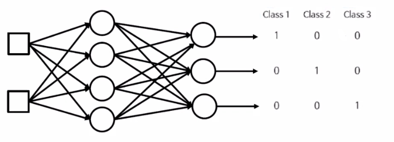
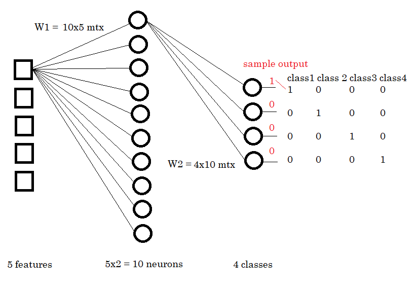
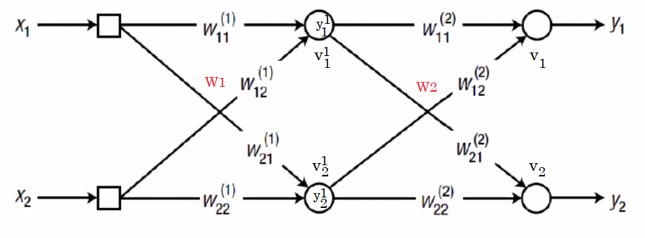
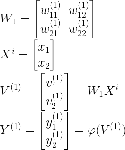
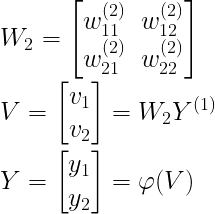
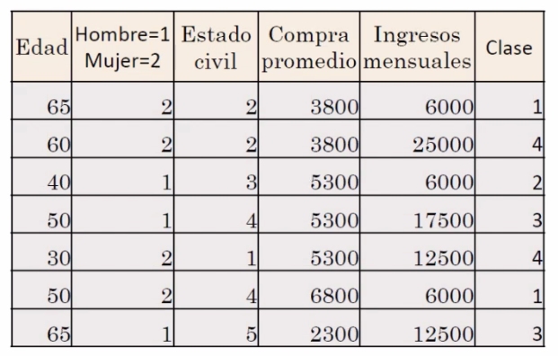

# Multiple Classification

The perceptron is an algorithm that uses a Simple Neural Network (Single-Layer), and it only works if our data set is linearly separable, that is, if we only got **two classes**.

**Multiple classification** is a solution for this problem, where it uses a neural network with more inner layers. The structure of the network would look like this:

- The squares represent the **input layer**, and the number of squares depends on the number of features the training set has.

- The neurons at the end are the **output layer**, in this case three: the number of neurons in the output layer is the number of classes possible. For each class, we will have a neuron in the output layer.

- The neurons in the middle make up for the **inner/hidden layer**, and it has in this case 4 neurons. It is quite a research field to define how many neurons in this layer we need, but a general rule is the following: the number of neurons of the hidden layer is **the number of features times two**.

The example [data set](dataset_multiclassOK.xlsx), shows 5 features and 4 possible classes, thus:

- Each input layer neuron has a **weight** that connects it to **each** of the neurons of the hidden layers.

- Now, for each feature we have 10 weights: we have the weights now as a matrix called W1.

- Thus, each inner layer neuron connects to each of the output layer neurons via another weight. W2 is now a matrix of weights as well, since each inner neuron has 4 weights.

In this way, we will have **two weight matrices**, W1 and W2. The hidden layer has an intermediate output that we need to calculate in order to be able to calculate the predicted output. This intermediate layer output will be computer as the **multiplication of W1 times the input vector of values**, as we used to in the perceptron. This intermediate output, *v1*, will be the **input vector** for the **multiplication of W2 times v1 vector** for the final output.

Thus, the differences are the weights matrices instead of vectors, the network structure, and the out also changes from the perceptron. Now, instead of having one neuron telling us either class 1 or -1, or class 1 or 0, we have N neurons that output altogether a **codified output**: each neuron outputs altogether an N-sized vector of 0 and 1 where the class is identified. The codified vector of the neurons' output can be different from binary, it can be a set of real numbers that add up to 1 (probabilities), and the highest value in that codified vector will be the predicted class. If the real numbers do not add up to 1, then the **activation function** that generated that output is not the correct one.

To see the inner calculations, let's visualize a simpler example:

The intermediate output for the inner layer, Y^1 is calculated as:

*Note: in this neural network we do not need any bias that translates the line model, since we do not have a line as model anymore*

The phi activation function will be the **Sigmoid function**, in order to transform the input into a value (0,1), so that this can activate or deactivate the neurons (inner neurons) according to the influence the neuron has in the next layer. Anyway, once we have this intermediate output we need to do the process again in order to calculate the next layer's output, which in this case, is the final output. The **input** for this calculation will be Y^1, the output of the previous layer.

We will use two activation functions in this algorithm: Sigmoid for the hidden layers and Softmax for output layer. Since the activation function is the **Softmax function**, each neuron in the output layer will result in a number between (0, 1), which represents **the probability of that data point belonging to said neuron's class**. The sum of the output vector of all neurons in the output layer must be 1.

Since the **error** can be measured at the end of layer 2, that is, the output layer, the weights of the connections between the hidden layer can be adjusted, but how do we adjust the weights of the connections between the input and the hidden layer? We need **Retropropagation Algorithm**, so that all weights can be adjusted.

An example of the data set is shown below. We normalize with z-score all the features, even the categorical ones.

Where the categories for Civil Status are:

- Bachelor = 1

- Married = 2

- Free Union = 3

- Divorced = 4

- Widow = 5

Where the categories for Potential Clients are:

- Client 1 = low

- Client 2 = medium

- Client 3 = medium-high

- Client 4 = high